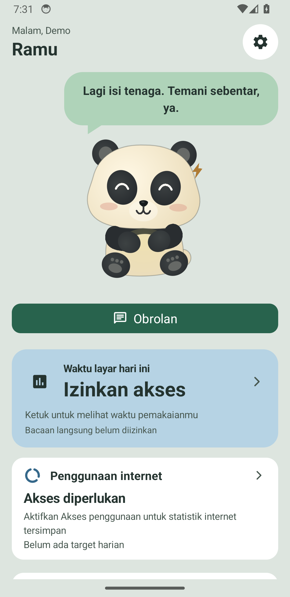
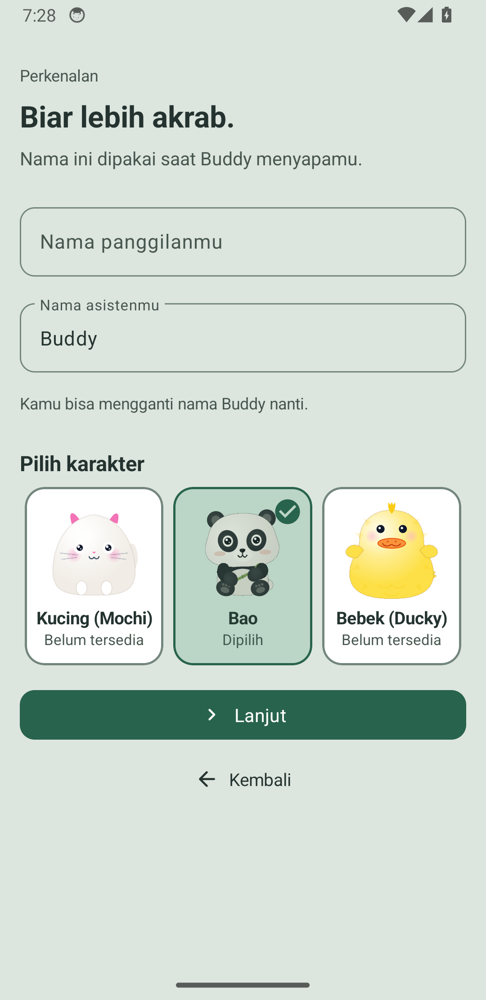
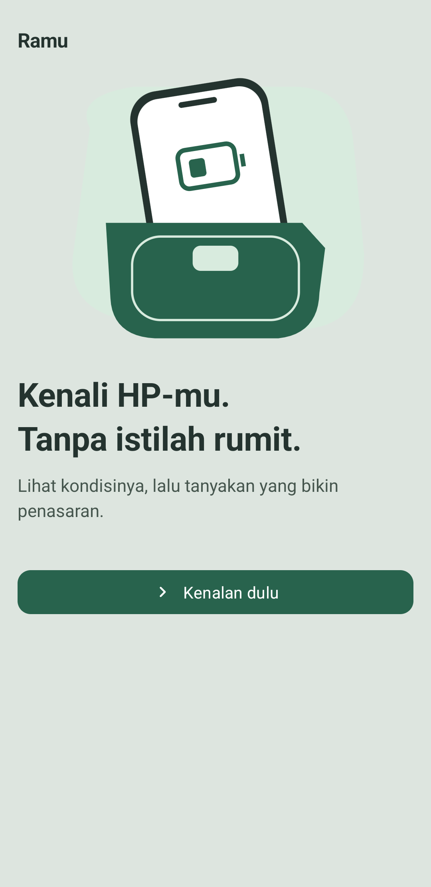
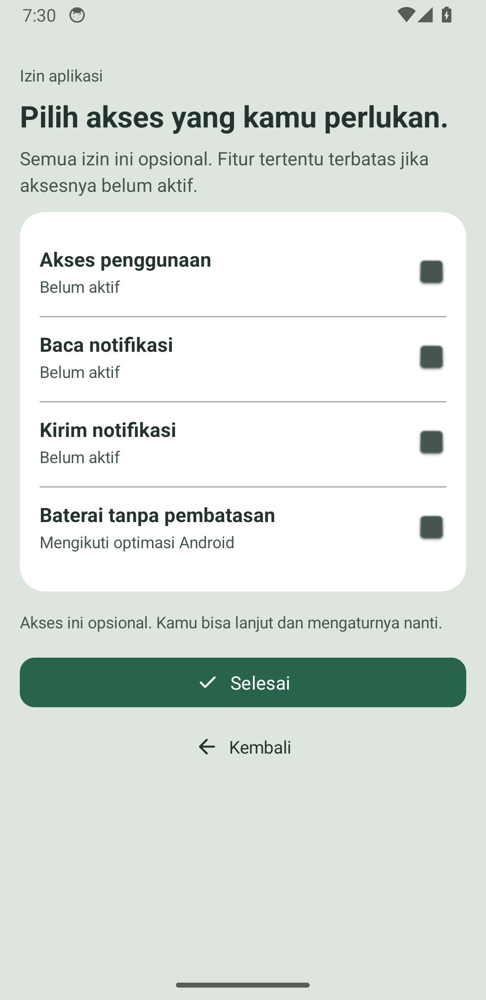

# Ramu

Ramu is an Android app for viewing device health and usage habits in one place. The home screen summarizes battery, memory, network, storage, screen time, and internet usage. Its companion character provides quick access to local AI chat and detailed views.

The project is currently in **beta 0.5**. Monitor values depend on data provided by Android and the permissions you grant. The AI model is not included in the APK.

## Download and install

1. Open [Ramu GitHub Releases](https://github.com/Terradjannah/Ramu/releases/tag/v0.5-beta) and download **Ramu.apk** from the *Assets* section. Do not install APKs from other sources.
2. On a phone running Android 10 or later, open the downloaded APK. If Android asks you to allow installs from this source, grant permission to the file manager or browser you are using, then continue the installation.
3. Launch Ramu and complete the initial setup. You can grant permissions later from **Settings → App permissions** in Ramu.

Direct download link for the Ramu website: [Ramu.apk](https://github.com/Terradjannah/Ramu/releases/download/v0.5-beta/Ramu.apk). You can check the installed version in Android's app information. Future updates must be signed with the same release key to install over an existing version.

## Features

| Section | What's available |
| --- | --- |
| Home | Summaries of screen time, internet, battery, RAM, network, and storage; companion character and a shortcut to chat. |
| Activity | Screen time details, app usage, internet usage, history, and user-configurable limits. |
| Device monitor | Battery, memory, network, storage, and sensor details, depending on device support. |
| Notifications | Local notification log when notification access is enabled. |
| Local AI | Chat with a Gemma model downloaded separately and run on-device through LiteRT-LM CPU. |
| Settings | Permissions, recording schedules, reminders, CSV export, and local backup and restore. |

## Requested permissions

Ramu shows permission status under **Settings → App permissions**. You can defer permissions during initial setup; related features will receive data only after you grant them.

| Access | How to grant it | Used for |
| --- | --- | --- |
| Usage access | Tap **Usage access**, select Ramu in Android settings, then allow access. | Screen time and per-app usage. |
| Notification access | Tap **Read notifications**, select Ramu, then approve the system dialog. | Local notification log. This permission can expose sensitive notification content to the app. |
| Send notifications | Tap **Send notifications** and allow access when prompted on Android 13 or later. | Reminders and monitoring service status. |
| Autostart and battery settings | If scheduled monitoring is delayed, check both options under **App permissions** and in your phone settings. | Helps recording and reminders run in the background. Behavior varies by device. |

Ramu also uses internet access to download AI models and run network features you choose. Exemption from battery optimization is optional. Granting permissions alone does not automatically enable every kind of recording or reminder.

## AI models and data

The APK does not include an AI model or a Hugging Face token. Open **Local models** in Ramu to choose a model. Downloads may require several gigabytes of free space, a Hugging Face account, acceptance of the model license, and a read token for gated models. Enter tokens only in the in-app form; do not include them in issues or public screenshots. Speed and RAM requirements depend on your phone.

Chats, monitoring records, settings, and downloaded models are stored on your device. CSV exports and local backups are shared only when you choose to export or share them. Model downloads and network checks use an internet connection. This source tree does not configure the endpoint or keys for remote model catalog updates, so do not assume the remote catalog is active in this build.

## Screenshots

These images were captured from a Ramu build on a fresh test emulator. Monitor values shown on the emulator are examples from the test device.

| Home | Introduction |
| --- | --- |
|  |  |

| Welcome | App permissions |
| --- | --- |
|  |  |

## Build from source

This repository contains the Android app and the Gradle files required to build it. Set up Android Studio with Android SDK 36 and JDK 21, then run:

```powershell
git clone https://github.com/Terradjannah/Ramu.git
cd Ramu
.\gradlew.bat :app:assembleRelease
```

Gradle produces an **unsigned** release APK. Before installation or distribution, the release maintainer must sign it with the project's keystore and verify its signature and checksum. The keystore, passwords, `local.properties`, models, user data, build outputs, and APKs are not stored in the source. Official APKs are available from GitHub Releases.

## Repository structure and license

`app/` contains the app source, resources, and Android tests; the Gradle files in the root are used for builds. Third-party licenses accompanying icons are available in [`app/src/main/assets/licenses/`](app/src/main/assets/licenses/). Gemma models have their own license terms at their download source and are not distributed here.

Ramu's code is published for viewing and building; the project source does not have a general reuse license. Contact the repository owner before reusing Ramu code or assets in another project. Report security issues privately through GitHub's **Report a vulnerability** feature, if available. Do not include tokens, backups, or personal data in public issues.
